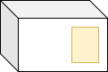
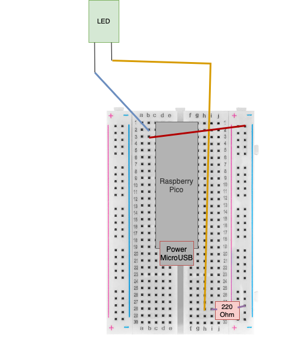

# Build a locksafe
## 1st preview
This guide will show you how to build your own chest secured with code. In addition, you will get to know the programming language Python through small tutorial blocks.<br>
>You will learn...
- ...retrieve data from a keypad.
- ...set up a small computer.
- ...to switch circuits with a relay.
- ...to control an LED.
- ...and many more things.
> What are the functions of the LockSafe chest?
- You can think of your own 6-digit code.
- If you enter incorrectly too many times, lock the chest for 60 seconds.
- Lock your secrets in the chest
- and many more functions...
## 2. Materials
Now we come to the material. I have created a list of products that we need for you here below.
> **Note**<br>
> You may already own a product. Therefore, only buy what you need.
- [Raspberry Pico](https://www.reichelt.de/raspberry-pi-pico-rp2040-cortex-m0-microusb-header-rasp-pi-pico-h-p305824.html?&trstct=vrt_pdn&nbc=1) => IMPORTANT: Order with pin headers
- [12v plug with USB and DC plug](https://www.amazon.de/Zolt-Universal-USB-Anschluss-DC-Plugin-Haushaltselektronik/dp/B0932YBT9X/ref=asc_df_B0932YBT9X/?tag=googshopde-21&linkCode =df0&hvadid=546566796845&hvpos=&hvnetw=g&hvrand=10075993509748832043&hvpone=&hvptwo=&hvqmt=&hvdev=c&hvdvcmdl=&hvlocint=&hvlocphy=9042442&hvtargid=pla-142940=1ps&c=th&c=1429404)
- [MicroUSB JBL charging cable](https://www.amazon.de/MicroUSB-Charging-Cable-Compatible-Bluetooth-Speaker-SOUNDGEAR-Speaker/dp/B08XYX2RRX/ref=asc_df_B08XYX2RRX/?tag=googshopde-21&linkCode=df0&hvadid=546482272521&hvpos= &hvnetw=g&hvrand=2394098469561120703&hvpone=&hvptwo=&hvqmt=&hvdev=c&hvdvcmdl=&hvlocint=&hvlocphy=9042442&hvtargid=pla-1573446825248&psc=1&th=1&psc=1)
- [Keypad 3x4](https://www.reichelt.de/en/developer-boards-membrane-keyboard-4-x-3-digits-debo-tast-4x3-p224223.html?&trstct=vrt_pdn&nbc=1)
- [connecting cable](https://www.amazon.de/Female-Female-Male-Female-Male-Male-Steckbrücken-Wirebrücken-bunt/dp/B01EV70C78/ref=asc_df_B01EV70C78/?tag=googshopde-21&linkCode=df0&hvadid= &hvdev=c&hvdvcmdl=&hvlocint=&hvlocphy=9042442&hvtargid=pla-362913641420)
- [plug-in board](https://www.kaufland.de/product/429289378/?kwd&source=pla&sid=41790452&gclid=Cj0KCQiAnNacBhDvARIsABnDa6-gY4RCjDM2pLt6dpFGdofF5kMT8Iouvvrn-3orQxaCjP3QdQzAJzkaAtBCEALw_wcB)
- Wooden box with flat lid
- [Relay](https://www.reichelt.de/entwicklungboards-relais-modul-5-v-srd-05vdc-sl-c-debo-relay-5v-p239148.html?CCOUNTRY=445&LANGUAGE=de&&r=1 )
- [Lock](https://www.amazon.de/gp/product/B01N650528/ref=ppx_yo_dt_b_asin_title_o07_s00?ie=UTF8&psc=1)
> **Note**<br>
> You only have to buy the following products if you want to use an LED:
- [220 ohms resistance](https://www.amazon.de/Metallfilm-Fest-Through-Hole-resistors-current-limiting-Rohs-certified/dp/B08QRXLKZQ/ref=sr_1_3_sspa?keywords=220+Ohm+Resistance&qid=1670753216&sr=8 -3-spons&sp_csd=d2lkZ2V0TmFtZT1zcF9hdGY&psc=1)
- [LED](https://www.reichelt.de/led-5-mm-bedrahtet-gruen-110-mcd-22--led-5mm-gn-p10232.html?PROVID=2788&gclid=Cj0KCQiAnNacBhDvARIsABnDa691HgcaGFhhWA0Ui6jMinj2Y0J1jq9og1Tg4IVw1qHux_hXO)
## 3. Set up Pico and Thonny
### 3.1 Connect Pico to PC
First you have to install the software on the Raspberry Pico. Because Python is too big, we use Circuitpython. Hold down the Bootsel button (which is on the Pico's board) and plug the Pico into your PC using the JBL charging cable. **Don't release the button until the pico appears on your PC**. (like a USB stick)
> **Warning**<br>
> Do not open any of the files that are on the Pico.
### 3.2 Load Pico software
Now visit [this](https://circuitpython.org/board/raspberry_pi_pico/) website and download the file. When the download is complete, put the file on the Raspberry Pico. The Raspberry Pico then ejects itself automatically and is no longer displayed. Unplug the Pico and plug it back in. Then it should have the name Circuitpython.<br>
### 3.3 Tony
Now visit [this](https://thonny.org) page and download the program. Run the file and open it.<br>
If the console below does not say that the device was found, click Run -> Configure the interpreter -> Type: CircuitPython (generic) off in the menu.
> If you still get an error, contact me at **moderatorps@gmail.com**.
## 4. Install pico in box
First, plug the pico into the breadboard:<br>

<br>Glue the breadboard (marked green) with the JBL connector (marked red) down in the box:<br>

Also cut a hole for the cable. (marked blue)
## 5.Keypad
First set the power supply to 12v on the back.<br>
Glue the keypad to the front of the box and again cut a hole for these cables behind the keypad. Image: <br>
<br>
Now plug in the keypad:<br>
<br>
Now create a new file in Thonny. (If none is already displayed) <br>
Paste this code:
```
import board
import keypad
import time
import digitalio

#Keypad pins used (GP Art)
rowPins = (board.GP10, board.GP11, board.GP12, board.GP13)
columnPins = (board.GP14, board.GP15, board.GP16)

#Create keypad matrix
keypadMatrix = keypad.KeyMatrix(rowPins, columnPins)

#key assignment
keyMap = { 0: "1", 1: "2", 2: "3", 3: "4", 4: "5", 5: "6", 6: "7", 7: "8" ,
               8: "9", 9: "*", 10: "0", 11: "#" }

#LED on the pico will be activated to see that the program is running
led = digitalio.DigitalInOut(board.GP25)
led.direction = digitalio.Direction.OUTPUT

#Info
print("Press a key!")

#continuous loop
while True:
     led.value = True
     event = keypadMatrix.events.get()
     if event:
         if event.pressed:
             print(keyMap[event.key_number])
             time.sleep(0.5)
```
Now save the Python code with the name **keypad_test.py**.
Now run the code with the arrow!
## 6. Relay and motor
**Install:**<br>
1.Hole in the front of the box where the engine clicks in<br>
2. Screw the motor to the ceiling towards the front<br>
3.Glue the relay next to the Pico with Tesa<br><br>
**Connect:**<br>
> **Warning**<br>
> Leave the keypad plugged in! I've hidden it in the image because you've already installed it.<br>
> 
##### code:
```
import board
import keypad
import time
import digitalio

#Signal pin connected to the relay
relay = digitalio.DigitalInOut(board.GP0)
relais.direction = digitalio.Direction.OUTPUT

#LED on the pico will be activated to see that the program is running
led = digitalio.DigitalInOut(board.GP25)
led.direction = digitalio.Direction.OUTPUT

#continuous loop
while True:
     led.value = True
     relay.value = True
     time.sleep(2)
     relay.value = False
     time.sleep(2)
```
Now save the Python code with the name **relais_test.py**.
Now run the code with the arrow!
## 7. LED (this step can be skipped if you don't want to include an LED)
**Install:**<br>
All you have to do is...<br>
...cut a hole next to the keypad.<br>
...put the LED through.<br>
**Plug in:**<br>
> **Warning**<br>
> Leave the keypad, relays, motor and so on plugged in! I've hidden it in the image because you've already installed it.<br>
> 
##### code:
```
import board
import keypad
import time
import digitalio
 
# LED setup.
led1 = digitalio.DigitalInOut(board.GP17)
led1.direction = digitalio.Direction.OUTPUT

#LED on the pico will be activated to see that the program is running
led = digitalio.DigitalInOut(board.GP25)
led.direction = digitalio.Direction.OUTPUT

#continuous loop
while True:
     led.value = True
     led1.value = True
     time.sleep(2)
     led1.value = False
     time.sleep(2)
```
Now save the Python code with the name **led_test.py**.
Now run the code with the arrow!
## 8. Summarize everything
> **Note**<br>
> Select to get the final code:
> - [With LED](english_final_mit_led.md)
> - [Without LED](english_final_ohne_led.md)
